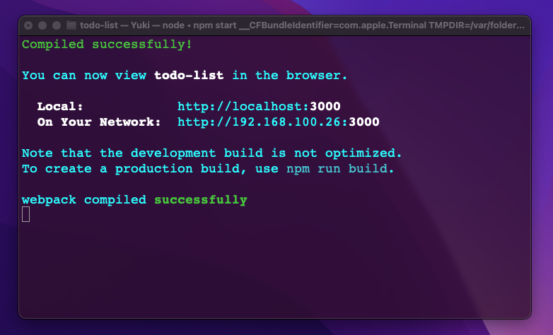

# Yuki Terminal Theme for macOS

Welcome to the repository of Yuki Terminal Theme for macOS! Enhance your terminal experience with this custom theme that provides a soothing and user-friendly interface tailored for readability and aesthetic pleasure.



## Installation

Follow these steps to install the Yuki terminal theme on your macOS:

### Prerequisites

- macOS Terminal or iTerm2
- Basic knowledge of terminal operations

### Downloading the Theme

1. **Clone the Repository**
   - Open Terminal.
   - Run the following command to clone the repository:
     ```bash
     git clone https://github.com/holasoymalva/yuki-terminal-theme.git
     ```

### Installing the Theme

2. **Import the Theme in Terminal**
   - Open Terminal.
   - Go to Terminal > Preferences > Profiles.
   - Under the Profiles tab, click the 'Import' button at the bottom left.
   - Navigate to the cloned repository and select `Yuki.terminal`.
   - After importing, make sure to set it as the default by clicking 'Default' at the bottom of the list.

3. **For iTerm2 Users:**
   - Open iTerm2.
   - Go to iTerm2 > Preferences > Profiles.
   - In the Colors tab, click on 'Color Presets...' at the bottom right.
   - Click 'Import...' and select the `Yuki.itermcolors` file from the cloned repository.
   - After importing, set it as the default by selecting it from the 'Color Presets...' dropdown.

## Usage

Once installed, your terminal will automatically apply the Yuki theme, and you can start enjoying a more visually pleasing terminal environment.

## Contributing

Feel free to fork the repository, make changes, and submit pull requests to contribute to the improvement of this theme.

## License

Distributed under the MIT License. See `LICENSE` for more information.

## Acknowledgements

- Thanks to all contributors who have helped in refining the Yuki Terminal Theme.
